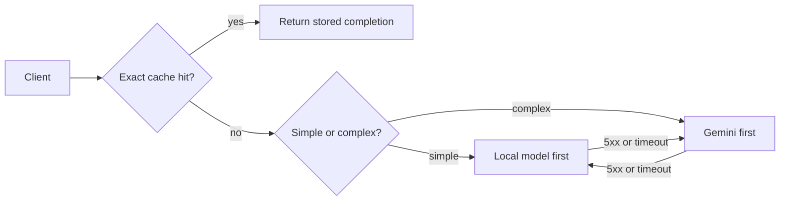
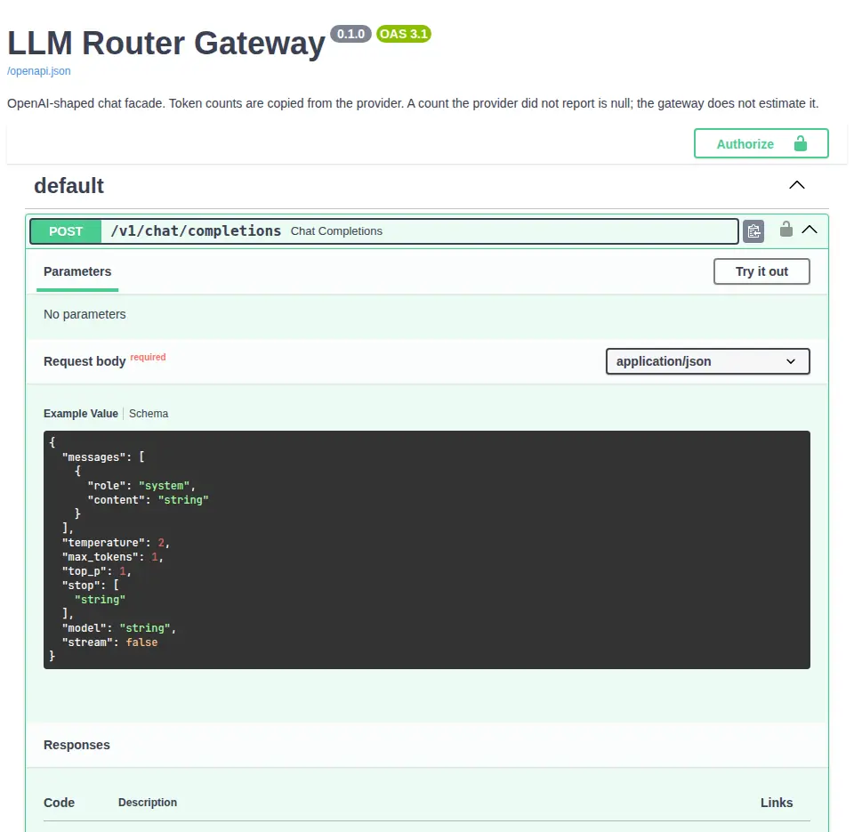
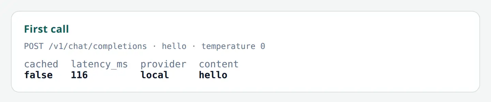

<p align="center">
  
</p>

# LLM Router Gateway

[](https://github.com/luizssantiago92/llm-router-gateway/actions/workflows/ci.yml)
[](https://github.com/luizssantiago92/llm-router-gateway/actions/workflows/codeql.yml)
[](LICENSE)
[](pyproject.toml)

One OpenAI-shaped endpoint caches exact repeats, sends simple prompts to a local model and complex prompts to Gemini, and fails over once.







## Try it in 1 minute

No Gemini key:

```bash
docker compose -f compose.demo.yml up --build
```

In another terminal:

```bash
./scripts/demo.sh
```

The gateway key is `demo`. OpenAPI is at <http://127.0.0.1:8000/docs>. The script checks health, sends `hello`, repeats it, then sends `simulate-local-failure` so the local hop fails and the cloud hop answers. `make demo` starts the same Compose file.

Live mode, with a Gemini key, is [Operations](docs/operations.md).

## Engineering decisions

- Callers send messages, temperature, and max tokens. They do not choose the provider.
- The cache is an exact match. An omitted temperature is stored as `1.0`. `top_p`, `stop`, and a Gemini model id join the key only when the caller set them.
- A short prompt tries the local model first. A long prompt, or a few code and reasoning keywords, tries Gemini first.
- A timeout, an HTTP 5xx, or an unexpected error hops once. An HTTP 4xx does not hop.
- If Redis cannot read or write the cache, the completion is still returned. If Redis cannot update the daily quota, the call stops.
- The quota bucket id is a scrypt digest of the caller credential. Cache hits do not spend a unit.
- The credential is checked before the body is read. Token counts are copied from the provider, or left null.

## Security

Report a vulnerability in private. See [SECURITY.md](SECURITY.md). Do not open a public issue for it, and do not commit `.env`. Compose publishes the API on `127.0.0.1:8000` and Redis on `127.0.0.1:6379`. Access logs leave out the prompt and the credential headers.

## Limitations

This is a local academic demo, not a production chatbot.

- One shared key, not per-tenant identity
- Streaming is rejected
- The cache is exact match only
- Gemini free-tier limits still apply outside demo mode
- Ollama is optional and stays outside Compose

[Architecture](docs/architecture.md) · [API](docs/api.md) · [Operations](docs/operations.md) · [Changelog](CHANGELOG.md) · [Contributing](CONTRIBUTING.md)

[MIT](LICENSE). Copyright (c) 2026 Luiz Santiago.
